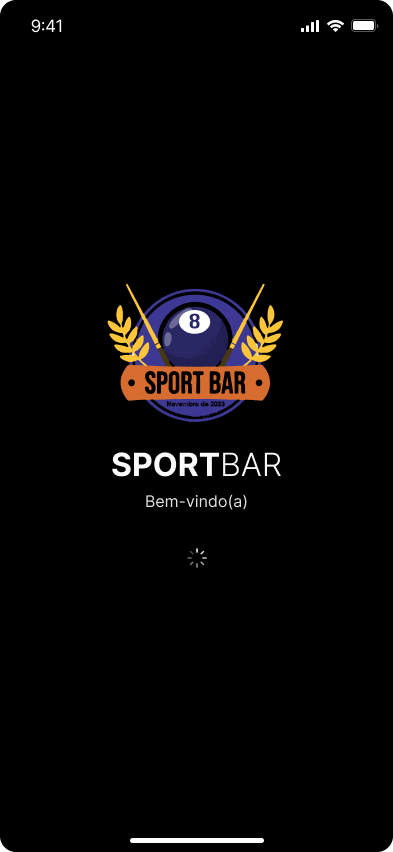
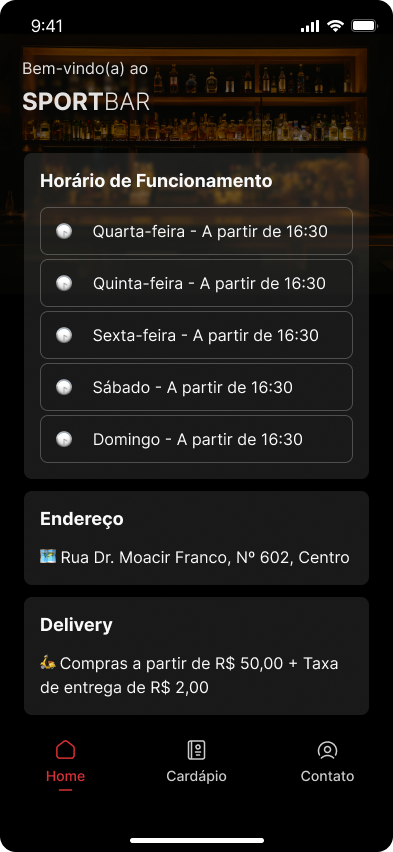
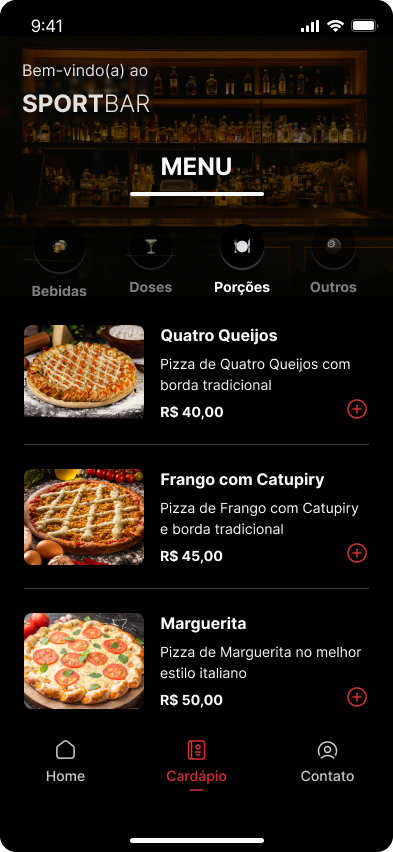

<h1 align="center">
    🍻 <a href="#" alt="Site do DoctorCare"> SportBar </a>
</h1>

<h3 align="center">
    🍻 Iced drinks, made-to-order snacks, snooker, and so much more! ❤️
</h3>

<p align="center">
  
  
  <a href="https://github.com/ana-ferreiramg/sportbar/commits/main">
    
  </a>
  <a href="https://jstack.com.br/">
    
  </a>
</p>

<h4 align="center">
	🚧 🍻 SportBar ⚙ In progress... 🚧
</h4>

<p align="center">
 <a href="#-about">About</a> •
 <a href="#-technologies">Technologies</a> •
 <a href="#-author">Author</a> •
</p>

## 📍 About

SportBar offers a responsive and customizable landing page for the trade of beverages and snacks.

---

### 📱 Mobile

<p align="center">
    
    
    
</span>

### 💻 Web

<p align="center">
    🚧 ⚙ In progress... 🚧
</p>

---

## 🚀 Getting Started

First, run the development server:

```bash
npm run dev
# or
yarn dev
# or
pnpm dev
# or
bun dev
```

Open [http://localhost:3000](http://localhost:3000) with your browser to see the result.

---

## 🛠 Technologies

The project was constructed using the following tools:

- 
- 
- 
- 
- 

---

## 🦸‍♀️ Author

<a href="https://github.com/ana-ferreiramg">
 
 <br />
 <sub><b>Ana Ferreira</b> 🚀</sub>
 <br />
 <br />

[](https://www.linkedin.com/in/ana--ferreira/)
[](mailto:anapaulaferreiradev@gmail.com)

---

Made with ❤️ by Ana Ferreira 👋🏽 [Contact me!](https://www.linkedin.com/in/ana--ferreira/)